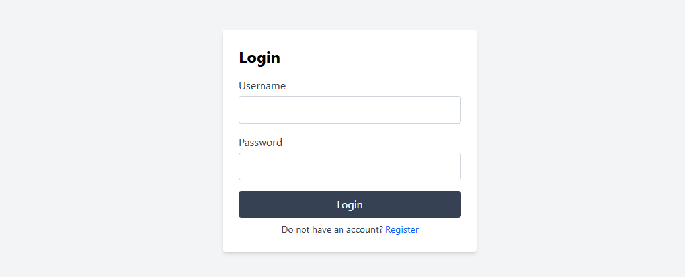

# Personal Finance Manager — Frontend

This is the React + Vite + Tailwind CSS frontend for the **Personal Finance Manager** web application.  
It provides a responsive and intuitive interface for managing personal finances, including accounts, transactions, budgets, recurring expenses, and savings goals.

---

## Overview

The frontend communicates with a Spring Boot backend using REST APIs secured with JWT authentication.  
Users can register, log in, and perform full CRUD operations on their personal finance data.

---

## Features

-Registration and Login
-Dashboard with summaries, recent transactions, and charts
-Transactions (filterable/sortable list and add/edit flows)
-Budgets (progress bars, monthly breakdowns)
-Savings Goals (progress tracking)
-ecurring Expenses (upcoming payments)
-Settings (user and UI preferences)

---

## Technology Stack

| Category | Technology |
|-----------|-------------|
| Framework | React 18 (Vite) |
| Styling | Tailwind CSS |
| Routing | React Router DOM |
| State Management | Context API + React Hooks |
| HTTP Client | Axios |
| Charts | Recharts |
| Authentication | JWT stored in localStorage |

---

## Project Structure
src/
 ├─ assets/
 │   └─ react.svg
 ├─ components/
 │   ├─ BalanceBreakdownChart.jsx
 │   ├─ BudgetBarChart.jsx
 │   ├─ BudgetProgressBars.jsx
 │   ├─ CashFlow.jsx
 │   ├─ ExpenseByCategoryBarChart.jsx
 │   ├─ ExpenseByCategoryBarChartVsPrev.jsx
 │   ├─ ExpenseByCategoryMonthChart.jsx
 │   ├─ ExpenseByCategoryPieChart.jsx
 │   ├─ ExpenseTransactions.jsx
 │   ├─ FilterBar.jsx
 │   ├─ Header.jsx
 │   ├─ Layout.jsx
 │   ├─ MonthlyExpenseChart.jsx
 │   ├─ NetMonthlySavingsBalanceChart.jsx
 │   ├─ NextPayments.jsx
 │   ├─ PrivateRoute.jsx
 │   ├─ RecentTransactions.jsx
 │   ├─ SavingsGoalsProgress.jsx
 │   ├─ Sidebar.jsx
 │   └─ SummaryCard.jsx
 ├─ contexts/
 │   ├─ AuthContext.tsx
 │   └─ SettingsContext.tsx
 ├─ hooks/                     # (reserved for custom hooks)
 ├─ pages/
 │   ├─ Accounts/
 │   ├─ Budgets/
 │   ├─ Dashboard/
 │   ├─ Expenses/
 │   ├─ Login/
 │   ├─ RecurringExpenses/
 │   ├─ Register/
 │   ├─ Savings/
 │   ├─ Settings/
 │   └─ Transactions/
 ├─ services/
 │   └─ auth.js                # axios instance, token attach, helpers
 ├─ styles/
 │   └─ index.css              # Tailwind directives
 ├─ utils/
 │   ├─ currency.js
 │   └─ dateUtils.js
 ├─ App.css
 ├─ App.jsx                    # routes and app shell
 ├─ index.css                  # base styles
 └─ main.jsx                   # entry point

## Authentication Flow

1. The user registers or logs in via `/api/users/register` or `/api/users/login`.
2. The backend responds with a JWT token.
3. The token is stored in `localStorage` and automatically included in all Axios requests:
4. Protected routes verify token validity through `AuthContext`.
5. Invalid or expired tokens redirect the user to the login page.

---

## Environment Configuration

Create a `.env` file in the project root with your backend URL: VITE_BACKEND_URL=http://localhost:8080
Then reference it in code: const BASE_URL = import.meta.env.VITE_BACKEND_URL;

## Running the Application
- install dependencies "npm install"
- Start the development server "npm run dev" 
  The app will be available at: http://localhost:5173
- Build for production
  "npm run build"

## Integration with Backend
-Backend: Spring Boot (Java 17+)
-Main API Base: http://localhost:8080/api
-Authentication: JWT tokens verified by JwtAuthenticationFilter
-CORS: Enabled via SecurityConfig.corsConfigurationSource()

The frontend expects the backend REST API to provide the following endpoints:

Endpoint	Method	Description
/api/users/register	POST	Register new user
/api/users/login	POST	Authenticate user
/api/accounts	CRUD	Manage accounts
/api/transactions	CRUD	Manage transactions
/api/budgets	CRUD	Manage budgets
/api/savings	CRUD	Manage savings goals
/api/recurring	CRUD	Manage recurring expenses

## UI Pages
Page	Description
Login / Register	Authentication forms
Dashboard	Displays summary charts and recent activity
Accounts	List and edit user accounts
Transactions	Filterable and sortable transaction list
Budgets	Create and track budgets
Savings Goals	Create and monitor savings targets
Recurring Expenses	Manage automated or repeating expenses

## Screenshots

### Dashboard

### Transactions

### Budgets

### Budgets

### Budgets

## Author
Jānis Kārkliņš
Developed as part of a full-stack personal finance project integrating a Spring Boot backend with a modern React frontend.
